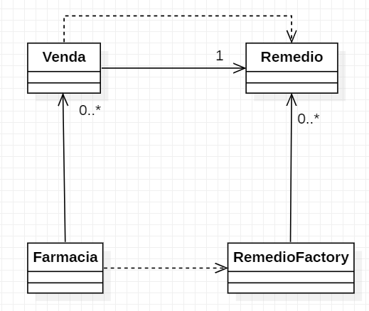

# Padrão Flyweight

Objetivo: econimizar recurso.  
Não utilizar objetos iguais repetidos.

**Caso de Uso**: Venda de remédios em uam farmácia, que geralmente vende sempre o mesmo tipo de medicamento.  
Ex: Analgésico, Fitoterápico, Anti-inflamatorio

> Neste caso, cada venda se refere apenas a um remédio.

